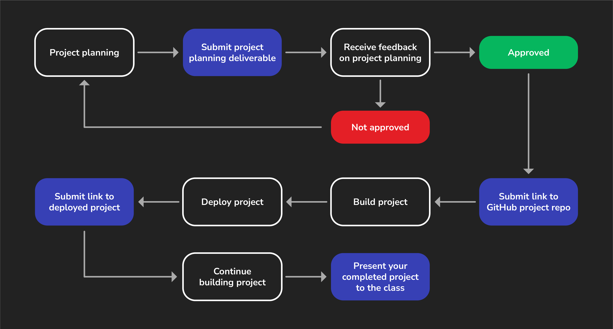

<h1>
  [tktk Headline]
  Project Journey
</h1>

tktk Depending on how you've constructed this project many parts of this document may need to change - ensure you review it thoroughly. This should be the last document built, after other aspects of the project are finalized so that you have a better view into the final process students will go through over the duration of a project. If any part of the project journey asset does not apply to this project, you should remove it.

Students typically learn the most while building projects. During this time, you'll be self-directed to plan, build, and complete your project.

You'll need to submit some key deliverables along the way to keep you on track. Finally, you'll present your completed project to the class.

This guide will walk you through the most important components of your project deliverable so that you can be sure you're not missing anything along the way.

## 1. Project info

Before you start planning, review the [project requirements](../requirements-and-guidance/README.md) to understand what features you must implement in your project. The **Guidance** section in that document also includes helpful tips to get started.

## 2. Project planning

Kick off your project with planning. For more details and the specific requirements, see the [[tktk Headline] Deliverables](../deliverables/README.md).

When you submit your project planning materials your proposal will either be approved, or you'll receive feedback and be asked to make adjustments before a final approval can be given.

## 3. Create a GitHub repo

Create the public GitHub repo that you'll use for the project. See the [[tktk Headline] Deliverables](../deliverables/README.md) for more details.

## 4. Build the project

The fun part! Start building your project! The printable [project requirements PDF](../requirements-and-guidance/assets/project-requirements.pdf) may be useful for checking items off as you build your project.

## 5. Deploy the work you have so far

Deploy your project to the internet following the included deployment guide and submit a URL for your deployed app. For more details, see the [[tktk Headline] Deliverables](../deliverables/README.md).

Continue working on your project until presentation day.

## 6. Present your project

This project will conclude with project presentations!
